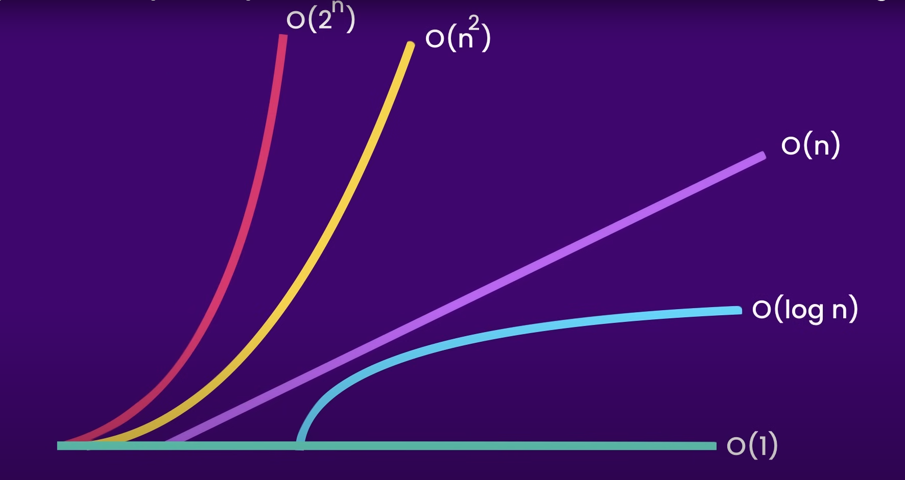

# DataStructure

Is a data organization, management and storage format that enables efficient access and modification.

There is multiply ways to handle the data to achieve high performance and efficient

## Access, Insertion, Deletion, Search.

ex.
`Array` is a dataStructure that is good for accessing the data

```java
System.out.print(array[0])
```

but the `Array` is not good for insertion or deletion so there is another methods. like `Linked List`.

There is two main types of Data Structure

# Primitive Data Structure

1. integer
2. float
3. character
4. pointers

# Non-primitive Data Structure

- Linear Data Structure (Linear Lists)
  1. Arrays
  1. Linked List
  1. Stack
  1. Queue
- Non-Linear Data Structure (Non-Linear Lists)
  1. Trees
  2. Graphs

# Complexity

One of the most important thing in Data Structure is the `complexity`. in any problem we face we will use an algorithm to solve it and the important thing about this algorithm is the `time` and `space` it takes
the `time` is more important nowadays because the space is almost available all the time.

ex.
Search for something in an array
[10,5,15,2,25,55]
it the desired number is at the start of the array this is called the `best case`, if the number is at the end of the array this is called `worst case`, if its in the middle this is called `average case`.

### best case : Omega Notation `Ω`

### average case : theta Notation `Θ`

### worst case : big O Notation `O`

### Big O Notation:

Big O notation is a mathematical notation that describes the limiting behavior of a function when the argument tends towards a particular value r infinity.

### What this has to do with data structures

Certain operation can be more or less costly depending on what data structure we use, for example accessing an array element by its index is super fast but arrays have a fixed length and if you want to constantly add or remove items from them they have to get get resized and this will get costly as the size of our input grows very large, so we use something called linked list this type of data structure can grow or shrink very quickly but accessing a linked list element by its index is slow so that's why we need you learn about the big O notation first before we can talk about various data structures

always aim to find the worst case to solve it

`ex.`
finding the summation from 1 to n

```java
int sum=0;
for(int i=1;i<=n;i++){ // n
    sum=sum+1; // constant time+n
}
```

In time complexity calculations all the mathematical and the logical operation takes constant time.

So in time complexity calculation we focus on the iteration and the recursive

In the prev example the sum= sum+1 takes constant time `'takes one step'` but the loop takes n time `'takes n of steps depending on the value of n'`

So the time complexity = 1+n
for the worst case 1 is negligible so the complexity = `O(n)`

another way of finding the summation without using the loop method is using a mathematical equation
`n*(n+1)/2`. this method is better because it takes a constant time
if n were to be 5, '5\*(5+1)/2=15' the time complexity for this is O(1).

best to worst

- O(1)
- O(log n)
- O(n)
- O(n log n)
- O(n<sup>2</sup>)
- O(2<sup>n</sup>)
- O(n!)
- 

ex.

```java
int i;
int i=0; // 1
for(i=0;i<n;i++){ //n
System.out.print(i);
}
for(int j=0;j<n;j++){ //n
    for(int k=0;k<n;K++){ //n
        System.out.print(j+k)
    }
}
```

the time complexity to this is `1+n+n*n`
the n\*n is from the nested loop

so the time complexity is 1+n+n<sup>2</sup> and the worst case is n<sup>2</sup>. the representation of it is O(n<sup>2</sup>)

if there is 3 nested loop the complexity will be O(n<sup>3</sup>)

ex.

```java
int i;
int i=1; // 1
for(i=0;i<n;i*2){ // log n
System.out.print(i);
}
```

if the iteration increment is multiplication the complexity is log n
the complexity = 1+log n
and the base of the log is the multiplication number so log<sub>2</sub> in this case
worst case is O(log<sub>2</sub> n)

ex.

```java
int i=0;//1
int j=0;//1
for( i;i<n;i++){ //n
    for( j;j<n;j/3){ // log n
        System.out.print(i+j)
    }
}
```

the complexity for the division case is also log<sub>3</sub>
complexity= 1+n\*log<sub>3</sub> n
worst case= O(n log<sub>3</sub> n)

```java
for(int i=0; i<n;i++)
{ //n
    for (int j=0; j<n;j++)
    {//n
        for(int k=0; k<n;k*2)
        {// log n
            System.out.print(i+j+k)
        }
    }
}
```

complexity= n \* n \* log<sub>2</sub> n = n <sup>2</sup> log<sub>2</sub> n
O(n <sup>2</sup> log<sub>2</sub> n)

ex.

```java
for(int i=n/2; i<n;i++)
{ // n/2
    for (int j=0; j<n;j=j*2)
    {//log n
        for(int k=0; k<n;k=k*2)
        {// log n
            System.out.print(i+j+k)
        }
    }
}
```

complexity= n/2 \* log<sub>2</sub> n \* log<sub>2</sub> n

complexity= n \* (log<sub>2</sub> n )<sup>2</sup>
= O(n \* (log<sub>2</sub> n )<sup>2</sup>)

ex.

```java
while (n>2){
    .
    .
    .
    .
    n=n/2

} // log n
```

complexity=O(log <sub>2</sub> n)

ex. fib equation

```java
int fib(int n){
    if(n<2)
    return n;
    return fib(n-1)+fib(n-2);
}
```

fib(4) will call fib(3)+fib(2) then fib(3) will call(fib(2)+fib(1)) and fib (2)wil call fib(1)+fib(0)
the relation here is exponential 2<sup>n</sup>
worst case =O(2<sup>n</sup>)

ex.
print the number and its half each iteration
100,50,25,12.5 ......

```java
public static void printNumberAndHalf(double n) {
    if (n < 1) {
        return;
    }

    System.out.print(n + ", ");

    // Calculate and print half of the number
    double half = n / 2.0;
    System.out.print(half + ", ");

    // Recursive call with half of the number
    printNumberAndHalf(half);
}

public static void main(String[] args) {
    double initialNumber = 100.0; // Starting number
    printNumberAndHalf(initialNumber);
}

```

The function starts with an initial number n and then repeatedly divides it by 2 until n becomes less than 1.

Each iteration of the function reduces the value of n by half.

Therefore, the number of iterations required to reach a value less than 1 is proportional to the number of times you can divide n by 2 until it becomes less than 1, which is exactly the definition of the logarithm base 2.

In Big O notation, this is expressed as O(log₂(n)), where n is the initial number.

ex.

```java
for(int i=0;i<n;i++){
    fun();
}
```

complexity= n \* fun complexity

ex.

```java
public void log(int[] numbers,String[] names){
    for(int number:numbers){ //O(n)
        System.out.println(number);
    }
    for(String  name :names){ //O(m)
        System.out.println(number);
    }
}
```

complexity=O(n+m)=O(n) because the run time of this method increases linearly

ex.

```java
public void log(int[] numbers,){
    for(int number:numbers){ //O(n)
        System.out.println(number);
    }
    for( int first  :numbers){ //O(n)
        for(int  second :numbers){ //O(n)
                System.out.println(first +","+second);
    }
    }
}
```

complexity=O(n+n<sup>2</sup>)=O(n<sup>2</sup>) because the run time of this method increases massively with n<sup>2</sup>
